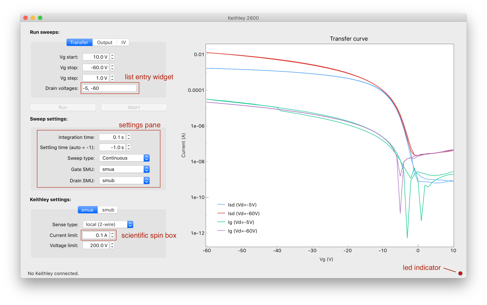

# pyqt-labutils

pyqt-labutils provides widgets for common use cases in scientific Guis. This includes a
LED status widgets, scientific spin boxes that work with units and prefixes (e.g., "µV")
and a widget to enter a list of numbers, for instance for points in a sweep.

Examples of how the widgets appear in a GUI can be found in
[keithleygui](https://github.com/OE-FET/keithleygui):



## System requirements

*Required*:

- Linux or macOS
- Python 2.7 or >= 3.6
- PyQt >= 5.9

## Installation

Install the latest version from github:
```console
$ pip install --update git+https://github.com/OE-FET/pyqt-labutils
```

## Acknowledgements

Scientific spin boxes are taken from [qudi](https://github.com/Ulm-IQO/qudi).
